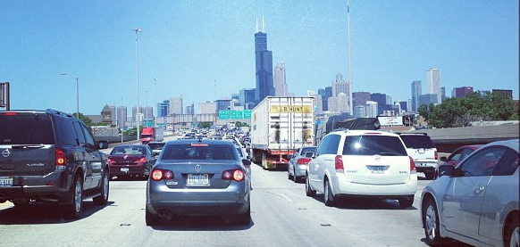
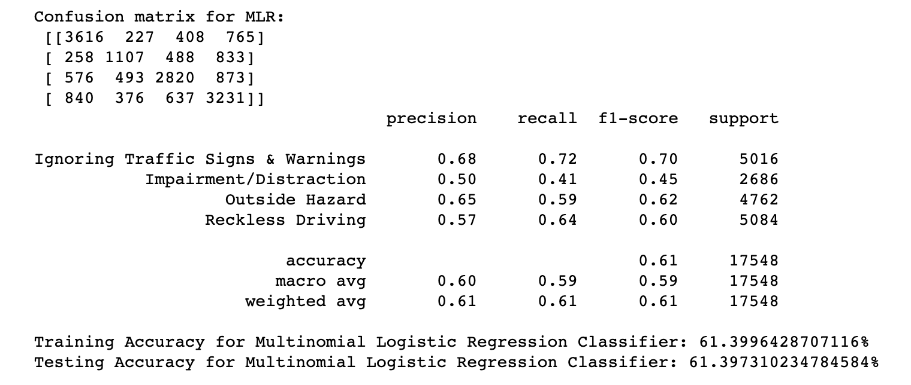
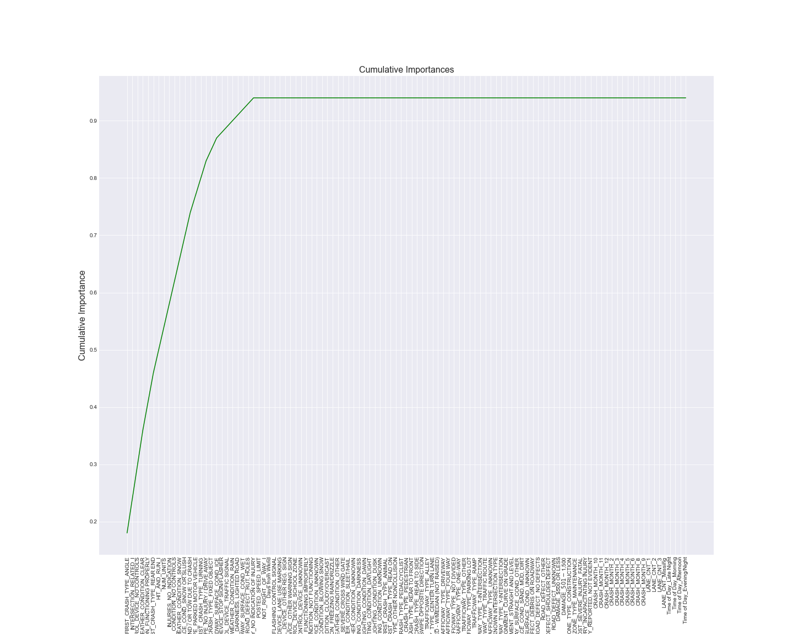

# Predicting Contributory Causes of Chicago Auto Accidents

Author: [Dom Garcia](mailto:dlgarcia.017@gmail.com)

# Overview

In this project, I inspect a dataset covering traffic accidents in the city of Chicago, IL (http://www.chicago.gov) and construct a classifier that predicts the primary cause of the accident.

# Business Problem

USAA wants to better understand the liability associated with their customers' accidents in order to determine the premiums they should be charging. As one of the country's biggest metropolitan areas with a variety of weather conditions, Chicago is a prime candidate for studying auto accidents.

The company hired a team of data scientists to study the primary cause of these accidents, which will provide insight on whether their customers' premiums should be adjusted. Furthermore, the team's research should make the company more aware of what conditions contribute most to predicting accident causes.

As the head of this team, I am in charge of building a classifier that will let the company know, given the facts about a customer's accident, whether that customer is due for an increased premium.

# Data

Data for this project is provided by the [City of Chicago](https://data.cityofchicago.org/Transportation/Traffic-Crashes-Crashes/85ca-t3if) and sourced from various police reports. Ultimately, over 70,000 auto accidents were analyzed & used for model construction. 

The dataset provides weather conditions, injury types and crash types, but that is just barely scratching the surface. I highly recommend following the link above or looking at the [Column_Description Notebook](https://github.com/dl-gd/flatiron-phase-3-project/blob/master/Column_Description.md) in this repository if you're curious about the wide range of details surrounding each crash. 

Finally, the target I try to predict in this project is the accident's primary cause, which has four distinct categories that I devised:

- **Outside Hazard**: Accidents primarily caused by hazards or distractions that the driver or passenger(s) cannot control while in the vehicle.

- **Impairment/Distraction**: Accidents primarily caused by a driver's impairment or by a distraction within in the car. 

- **Reckless Driving**: Accidents primarily caused by a driver failing to follow commonly understood safe driving procedure.

- **Ignoring Traffic Signs & Warnings**: Accidents primarily caused by a driver failing to follow legal warnings, signs or signals posted on the road.

# Methods

This project uses multiclass classification. For this task, a list of features (in this case, facts surrounding an auto accident) is given to a classifier, which then outputs a prediction about the primary cause of the accident.

The following algorithms are used & compared to naive DummyClassifiers: Multinomial Logistic Regression, Decision Tree, Random Forest, XGBoost. Each of these classifiers has parameters fine-tuned, whether iteratively for a single parameter (Logistic Regression) or exhaustively for combinations of parameters (Decision Tree, Random Forest, XGBoost).

# Results

Based on accuracy score, the Multinomial Logistic Regression classifier performs best, with a score of about 61.4% on test data. Though this result may not be optimal, the model is still about 2.5 times more accurate than the project's naive "random guesses" (whether uniform or based on class counts).

The classifier's cause predictions are, in order from most to least dependable (based on per-class F1): 'Ignoring Traffic Signs & Warnings', 'Outside Hazard', 'Reckless Driving', & 'Impairment/Distraction.' In other words, it is best at predicting whether a crash is primarily caused by ignoring traffic signs & warnings, and worst at predicting whether a crash is primarily caused by impairment/distraction.

Additionally, iterative modeling narrows down the number of important features to 25 (visualized below as the features that add to the line before it plateaus). As seen in the cumulative importance plot (based on decision tree importances), a majority of input features that I work with in this project have no noticeable impact on classification.

Despite multiple rounds of feature selection & elimination, the following features have the biggest predictive importance across multiple classifiers, and should be considered important aspects in determining the cause of an auto accident:

- First crash type: at an angle, during a turn, collision with a parked vehicle, rear end collision
- Outdoor conditions: clear, snowy
- Whether there was a traffic control device at the scene
- Whether the accident involved a personal injury or a towed vehicle
- Whether the accident was a hit-and-run
- Road surface conditions: ice, snow/slush, wet
- Number of parties involved
- Whether the accident occured at an intersection

# Conclusions

Based on my findings, I would recommend the following to USAA:

- **If a client's accident cause is determined to be 'Ignoring Traffic Signs & Warnings': Consider increasing their premium.**
- **If a client's accident cause is determined to be 'Outside Hazard': Consider minimal or no increase to the premium, as the accident has been caused by something out of the client's control.** 
- **If a client's accident cause is determined to be 'Reckless Driving': Consider increasing their premium.** Additionally, flag the client as a candidate to drop if the reckless driving continues. It is harder to write off such causes as accidental or momentary, like one conceivably could with 'Ignoring Traffic Signs & Warnings.'
- **If a client's accident cause is determined to be 'Impairment/Distraction': Do not make any conclusions about the case, and use the prediction as a prompt to investigate more closely.** This is due to both the class' poor performance metrics & its relative ambiguity ('Impairment/Distraction' covers everything from drunk driving to medical emergencies while operating a vehicle)

## Future Work

Given more time, I would do the following:

- **Look closely at coefficient penalties for my logistic regression model & determine which features are most impactful for each specific class**. Additionally, this exploration could determine which 'impact features' all of the classes share.

- **Inspect the city's dataset on people involved in these same accidents**. Using common indices across the two datasets, I could create a feature that measures how many people were in the vehicles in each wreck and explore the impact that this feature has on the target.

- **Look into whether I could break down the 'Impairment/Distraction' class any further**. Perhaps, as this class undergoes specification, the performance for both the class(es) and overall model would improve significantly. 

# For More Information

See the full analysis in the [Jupyter Notebook](https://github.com/dl-gd/flatiron-phase-3-project/blob/master/car_crashes_chicago.ipynb) or check out this [presentation overview](https://github.com/dl-gd/flatiron-phase-3-project/blob/master/Presentation.pdf). 

For additional information, contact Dom Garcia at [dlgarcia.017@gmail.com](mailto:dlgarcia.017@gmail.com)

